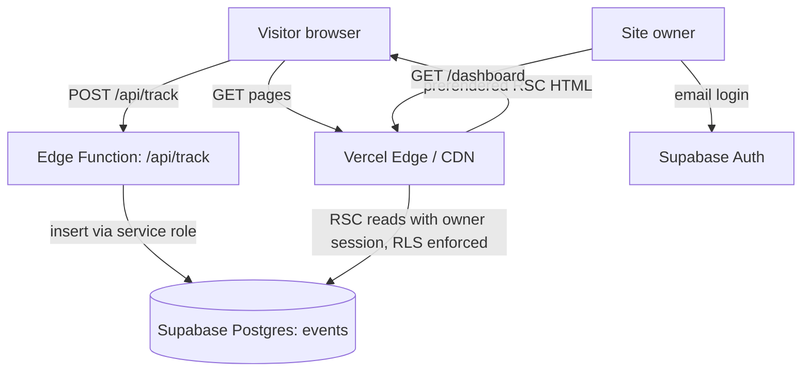
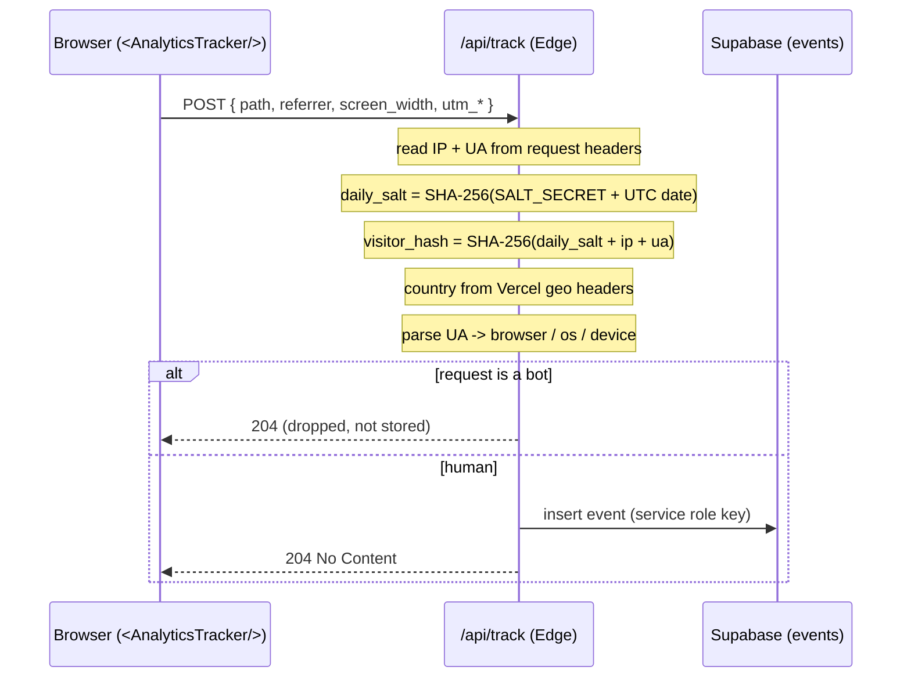
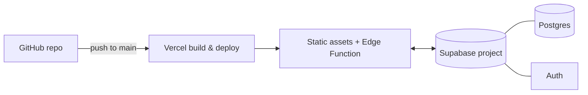

# Architecture

## Guiding principles

1. **Static by default.** The public site is content, not an application. Every page a
   visitor sees is a React Server Component rendered ahead of time and served from the
   edge. No client data fetching, no spinners.
2. **One server endpoint.** The only custom server code that runs per-request is
   `POST /api/track`. Auth is handled by Supabase; dashboard reads go straight to Postgres
   through the Supabase client with row-level security. We never build an API we don't need.
3. **Collect the minimum.** The analytics pipeline captures what's useful for understanding
   traffic and nothing that identifies a person. Privacy is a design constraint, not a
   feature bolted on later.
4. **Free-tier native.** Everything is sized to run on Vercel Hobby + Supabase Free.

---

## System overview

Three independent paths:

- **Serving content** — static Server Components delivered from Vercel's CDN. Supabase is
  not involved.
- **Recording a visit** — a small client component posts a beacon to `/api/track`, which
  enriches and writes one row to `events`.
- **Reading analytics** — the owner logs in via Supabase Auth; the `/dashboard` route reads
  aggregates directly from Postgres, with RLS ensuring only the owner sees any rows.

Keeping these paths separate is what lets the "only one API route" rule hold.

---

## Rendering strategy

| Route group        | Rendering                        | Data source            | Auth |
| ------------------ | -------------------------------- | ---------------------- | ---- |
| `/`, `/about`, `/projects`, `/projects/[slug]`, `/contact` | Static (SSG) Server Components | Local MDX / TS content | none |
| `/dashboard`       | Dynamic Server Component         | Supabase (RLS)         | required |
| `/login`           | Client component                 | Supabase Auth          | none |
| `/api/track`       | Edge Function                    | writes Supabase        | none (public) |

**Why content lives in the repo.** Portfolio content changes rarely and belongs to you, so
it ships as MDX/TS in `content/` and is compiled into static pages at build time. This
keeps the public site a pure-React, zero-API surface and means the database is used for one
thing only: analytics. If you later want to edit content without deploying, that's a
deliberate future step (see [ROADMAP](ROADMAP.md)), not a v1 requirement.

---

## The tracking path in detail

Design notes:

- **Client side is deliberately tiny.** `<AnalyticsTracker />` is a client component mounted
  once in the root layout. It fires on first load and on every App Router navigation
  (`usePathname`), sending a `fetch` beacon. It contains no identifiers and does no
  fingerprinting — all enrichment happens server-side where the raw IP never leaves.
- **The endpoint returns `204 No Content`.** There's nothing for the browser to do with the
  response, so we keep it empty and fast.
- **Edge runtime.** The route runs on Vercel's Edge runtime for low latency and easy access
  to geo headers (`x-vercel-ip-country`). The Supabase insert uses the HTTP client, which
  works on Edge. If a future dependency needs Node APIs, switching this one route to the
  Node runtime is a one-line change.
- **Service role, server-only.** Inserts use the Supabase **service role key**, which
  bypasses RLS. That key exists only in server environment variables and is never shipped to
  the browser. This is why the `events` table can deny all public access while still
  accepting writes. See [DATA_MODEL](DATA_MODEL.md#row-level-security).

Full endpoint contract and reference implementation: [ANALYTICS](ANALYTICS.md).

---

## The dashboard path in detail

- The owner signs in at `/login` using Supabase Auth (email magic link or password).
- The session is stored in cookies via `@supabase/ssr` and read on the server.
- `/dashboard` is a dynamic Server Component. It creates a request-scoped Supabase client
  bound to the owner's session and queries aggregates (page views, uniques, sessions,
  top referrers, UTM breakdown, geography) directly.
- **RLS does the enforcement.** The `SELECT` policy on `events` only returns rows to the
  authenticated owner. Even if the dashboard query were wrong, the database would return
  nothing to anyone else. No custom API, no hand-written authz checks in application code.

---

## Infrastructure

| Concern         | Service            | Tier for a personal site        |
| --------------- | ------------------ | ------------------------------- |
| Hosting / CDN   | Vercel             | Hobby (free, personal use)      |
| Serverless/Edge | Vercel Functions   | included                        |
| Database        | Supabase Postgres  | Free                            |
| Auth            | Supabase Auth      | Free                            |
| CI/CD           | Vercel Git integration | push-to-deploy from `main`  |

Environment variables are listed in [SETUP](SETUP.md#environment-variables). The critical
split: `NEXT_PUBLIC_*` values are safe in the browser; `SUPABASE_SERVICE_ROLE_KEY` and
`ANALYTICS_SALT_SECRET` are **server-only** and must never be prefixed `NEXT_PUBLIC_`.

---

## Key design decisions

Short rationale for the choices most likely to be questioned in review.

**Roll our own analytics instead of Plausible/Umami/Vercel Analytics.**
The drop-in tools are excellent and genuinely less work. We chose to build for two reasons:
(1) it's a portfolio, and a small, correct, privacy-conscious data pipeline is a better
work sample than a `<script>` tag; (2) it gives full control over the schema, so questions
like "which UTM campaign converted to a contact-form view" are just SQL. The tradeoff is
that we own bot filtering, sessionization, and the dashboard — all scoped deliberately small.

**Cookieless daily-rotating hash instead of a visitor cookie.**
A cookie would give stable long-term identity but triggers consent-banner obligations and
stores a persistent identifier. The daily hash gives us same-day sessionization and unique
counts while making cross-day tracking impossible by construction. Details and the honest
limitations are in [ANALYTICS](ANALYTICS.md#why-a-daily-rotating-hash).

**Sessionize at query time, not write time.**
Because the visitor hash is stable within a UTC day, we can derive sessions (30-minute
inactivity windows) with a window-function query at read time. This keeps the write path a
single unconditional `INSERT` with no read-before-write, and keeps the schema simple. The
query lives in [DATA_MODEL](DATA_MODEL.md#deriving-sessions).

**Content in the repo, not the database.**
Keeps the public site a pure-React static surface and preserves the "one API route" property.
A CMS-style content table is a possible later step, not a v1 need.

**Edge runtime for the tracking route.**
Lowest latency for a fire-and-forget beacon and native geo headers. The insert works over
HTTP from the edge. Documented as swappable to Node if needed.
