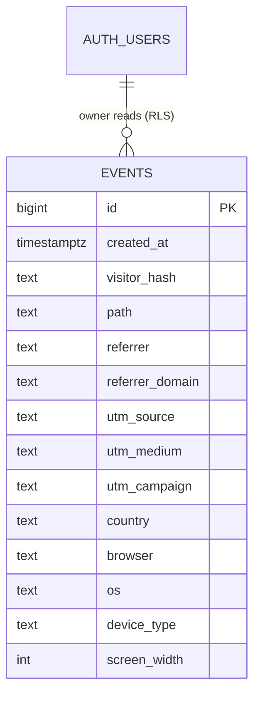

# Data Model

The database does exactly one job: store analytics events and let the owner read them
back. There is a single application table, `events`. Auth tables are managed by Supabase.

## Entity overview



`AUTH_USERS` is Supabase's built-in `auth.users`. There is no foreign key from `events` to a
user — events are anonymous. The relationship shown is *access*, enforced by RLS, not a join.

---

## The `events` table

One row per page view.

| Column            | Type          | Null | Notes                                                        |
| ----------------- | ------------- | ---- | ------------------------------------------------------------ |
| `id`              | `bigint`      | no   | Identity PK. `bigint` over `uuid` for cheap sequential inserts. |
| `created_at`      | `timestamptz` | no   | `default now()`. All time-range queries key off this.        |
| `visitor_hash`    | `text`        | no   | Salted daily hash of IP + user agent. Stable within a UTC day only. |
| `path`            | `text`        | no   | Pathname only, e.g. `/projects/analytics`. No query string.  |
| `referrer`        | `text`        | yes  | Full referrer URL if the browser sent one.                   |
| `referrer_domain` | `text`        | yes  | Host extracted from `referrer`, e.g. `linkedin.com`. Handy for grouping. |
| `utm_source`      | `text`        | yes  | From the landing URL's query string.                         |
| `utm_medium`      | `text`        | yes  |                                                              |
| `utm_campaign`    | `text`        | yes  |                                                              |
| `country`         | `text`        | yes  | 2-letter ISO code from Vercel geo headers. No city, no region. |
| `browser`         | `text`        | yes  | Parsed from UA, e.g. `Chrome`.                               |
| `os`              | `text`        | yes  | Parsed from UA, e.g. `macOS`.                                |
| `device_type`     | `text`        | yes  | `desktop` \| `mobile` \| `tablet`.                           |
| `screen_width`    | `int`         | yes  | Viewport width bucket, for a device-mix chart.               |

**Deliberately absent:** no IP address, no cookie/visitor UUID, no full user-agent string,
no city-level geo, no query strings. If a column can't earn its place in a chart on the
dashboard without identifying someone, it isn't here.

### Why UTM columns matter for this project

The whole point of the site is a job search. UTM tags let you tell apart traffic you seeded
yourself — a résumé link (`?utm_source=resume`), a LinkedIn post, a specific job
application — so you can see which channels actually bring people in. Tag your own links and
these columns fill in automatically.

---

## Schema (migration `0001_init.sql`)

```sql
-- Analytics events. One row per page view.
create table public.events (
  id              bigint generated always as identity primary key,
  created_at      timestamptz not null default now(),
  visitor_hash    text        not null,
  path            text        not null,
  referrer        text,
  referrer_domain text,
  utm_source      text,
  utm_medium      text,
  utm_campaign    text,
  country         text,
  browser         text,
  os              text,
  device_type     text,
  screen_width    int
);

-- Time-range scans (almost every dashboard query filters on a window).
create index events_created_at_idx on public.events (created_at desc);

-- "Top pages" grouping.
create index events_path_idx on public.events (path);

-- Sessionization + unique-visitor counts per visitor within a day.
create index events_visitor_idx on public.events (visitor_hash, created_at);
```

### Index rationale

- `events_created_at_idx` — every dashboard panel is "in the last N days," so a descending
  index on `created_at` serves the range scans.
- `events_path_idx` — supports `GROUP BY path` for the top-pages panel.
- `events_visitor_idx` — the composite `(visitor_hash, created_at)` supports both counting
  distinct visitors and the window-function sessionization query below.

At personal-portfolio volume none of this is load-bearing, but the indexes reflect the
access patterns and cost nothing to include.

---

## Row-level security

RLS is the entire authorization model. There is no application-level access check anywhere.

```sql
alter table public.events enable row level security;

-- Reads: only the authenticated owner, matched by email claim.
create policy "Owner can read events"
  on public.events
  for select
  to authenticated
  using ( auth.jwt() ->> 'email' = 'you@example.com' );

-- No insert/update/delete policies exist for anon or authenticated roles.
-- Writes happen exclusively from the server using the service role key,
-- which bypasses RLS entirely.
```

How this holds together:

- **Public / anon role** — no policy grants any access, so a leaked anon key can neither
  read nor write `events`.
- **Authenticated owner** — the `SELECT` policy returns rows only when the JWT email matches
  the owner. Replace `you@example.com` with your address; for multiple owners, use
  `auth.jwt() ->> 'email' in (...)` or check membership in a small allowlist table.
- **The tracking endpoint** — runs server-side with the service role key. Service role
  bypasses RLS, so inserts succeed even though no insert policy exists for public roles.
  This is exactly why the key must stay server-only (see
  [ANALYTICS](ANALYTICS.md) and [SETUP](SETUP.md#environment-variables)).

> Restrict sign-ups in the Supabase Auth settings so random visitors can't create an
> account. For a single-owner site, create your user once and disable public sign-up.

---

## Deriving sessions

A session is a run of page views from one `visitor_hash` with no gap longer than 30 minutes.
Because the hash is stable within a UTC day, this is a read-time window-function query — no
`session_id` is stored.

```sql
-- Count sessions in the last 30 days.
with ordered as (
  select
    visitor_hash,
    created_at,
    lag(created_at) over (
      partition by visitor_hash order by created_at
    ) as prev_at
  from public.events
  where created_at >= now() - interval '30 days'
),
marked as (
  select
    *,
    case
      when prev_at is null
        or created_at - prev_at > interval '30 minutes'
      then 1 else 0
    end as is_session_start
  from ordered
)
select count(*) filter (where is_session_start = 1) as sessions
from marked;
```

Other core dashboard aggregates:

```sql
-- Page views and unique visitors, last 7 days.
select
  count(*)                        as page_views,
  count(distinct visitor_hash)    as unique_visitors
from public.events
where created_at >= now() - interval '7 days';

-- Top pages.
select path, count(*) as views
from public.events
where created_at >= now() - interval '30 days'
group by path
order by views desc
limit 10;

-- Where traffic comes from (great during a job hunt).
select
  coalesce(utm_source, referrer_domain, 'direct') as source,
  count(*) as views
from public.events
where created_at >= now() - interval '30 days'
group by 1
order by views desc;
```

### A note on "unique visitors"

Because the hash rotates every UTC day, `count(distinct visitor_hash)` over a multi-day
window counts *unique-visitor-days*, not unique people. Over a single day it's a true
unique count. This is an intentional accuracy-for-privacy trade; the dashboard labels
multi-day figures accordingly so the numbers aren't misread. Rationale in
[ANALYTICS](ANALYTICS.md#why-a-daily-rotating-hash).

---

## Growth options (not v1)

- **`daily_stats` rollup** — a materialized view or a table populated by a scheduled
  Supabase function, for instant dashboard loads once the `events` table gets large.
- **Custom events** — add an `event_type` column (default `pageview`) to record things like
  résumé downloads or contact-form submissions without a new table.
- **Retention window** — a scheduled job to delete events older than N months, so the table
  stays small and old data isn't kept indefinitely.

These are tracked in [ROADMAP](ROADMAP.md).
